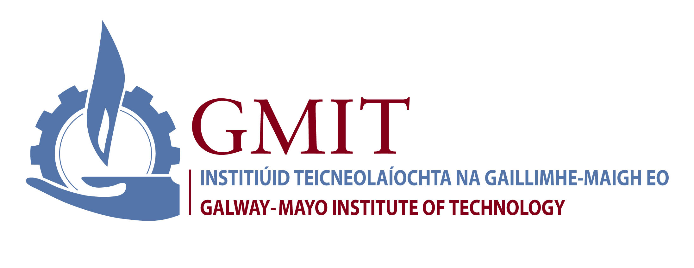

<h2 align="center">
    Gesture Recognition Project
</h3>

<h3 align="center">
    A program written in Python to control computer functionality using hand gestures
</h4>

<p align="center">
  
</p>

## Project Details
Heading  | Details
-------- | -------------------------------------
Project  | [Project Spec](https://learnonline.gmit.ie/pluginfile.php/316035/mod_resource/content/0/Gesture%20Based%20UI%20Project.pdf)
Course   | BSc (Hons) in Software Development
Module   | Gesture UI Development
Author   | Grace Keane 
ID       | G00359990
Lecturer | Damien Costello

## Contents
- [Repository Description](#repository-description)
- [Running the Program](#running-the-program)
- [Setting up Movie environment](#setting-up-movie-environment)
- [software used](#software-used)
- [Software imports used](#software-imports-used)
- [Purpose of the application](#sha512-overview)
- [Appropriate gestures](#appropriate-gestures)
- [Hardware used in creating this application](#hardware-used-in-creating-this-application)
- [Architecture for the solution](#architecture-for-the-solution)
- [Testing](#testing)
- [Conclusion and Recommendations](#conclusion-and-recommendations)
- [Referances](#referances)

## Repository Description
```bash
├── Images # Folders contains images discussed in README.md
│   ├──  # GMIT.jpeg
│   └──  # Image 2
│   └──  # Image 3
│   └──  # Image 4
├── Test_Video 
│   └──  Frozen-Meeting Olaf Clip (HD).mp4 # Movie clip used for project demo
├── Screencasts # Folder containing screencasts of how to set-up, deploy and run project
│   ├── # Screencast 1 (Running)
|   └── # Screencast 2 (Demo)
├── .gitignore # Text file listing files to ignore
├── README.md # Full overview and description of project

```

## Running the Program
1. In your command line terminal: ```git clone https://github.com/GraceKeane/gesture_control```<br>


- Add screencasts to explain how to run goes here


## Software used
- [Python 3.8.5](https://www.anaconda.com/products/individual)
- [PyCharm](https://www.jetbrains.com/pycharm/download/#section=windows)
- [Windows Media Player](https://en.softonic.com/downloads/windows-media-player-for-windows-10?utm_source=SEM&utm_medium=paid&utm_campaign=EN_AU_DSA_Downloads&gclid=CjwKCAjwvMqDBhB8EiwA2iSmPPnNLXi2suMdKo2Q-lxLarCQxHqjjRmUMZxXfTrIdIB-IJVqoGvUXRoCjlIQAvD_BwE)
- [Open CV](https://opencv.org/)

## Software imports used

## Purpose of the application

## Appropriate gestures 

- Images of gestures used here

## Hardware used in creating this application

## Architecture for the solution

## Testing

## Conclusion and Recommendations

## Referances
- OpenCv, General Information <br>
https://docs.opencv.org/3.4/d0/da7/videoio_overview.html